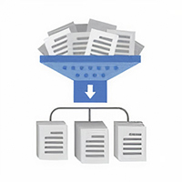

#  Курс 3 "Поиск структуры в данных"
В машинном обучении встречаются задачи, где нужно изучить структуру данных, найти в них скрытые взаимосвязи и закономерности. Например, нам может понадобиться описать каждого клиента банка с помощью меньшего количества переменных — для этого можно использовать методы понижения размерности, основанные на матричных разложениях. Такие методы пытаются сформировать новые признаки на основе старых, сохранив как можно больше информации в данных. Другим примером может служить задача тематического моделирования, в которой для набора текстов нужно построить модель, объясняющую процесс формирования этих текстов из небольшого количества тем.

Такие задачи назвают обучением без учителя. В отличие от обучения с учителем, в них не предполагают восстановление зависимости между объектами и целевой переменной. 

Из этого курса вы узнаете об алгоритмах кластеризации данных, с помощью которых, например, можно искать группы схожих клиентов мобильного оператора. Вы научитесь строить матричные разложения и решать задачу тематического моделирования, понижать размерность данных, искать аномалии и визуализировать многомерные данные.

## [Неделя 1](week_1.md) Кластеризация
 * Введение в кластеризацию
 * Подробнее о методах кластеризации
 * __Assignment__ Размещение баннеров

## [Неделя 2](week_2.md) Понижение размерности и матричные разложения
 *  Понижение размерности и отбор признаков
 *  Матричные разложения
 *  Библиотека sklearn. Введение
 *  __Assignment__ Метод главных компонент

## [Неделя 3](week_3.md) Визуализация и поиск аномалий
 * Поиск аномалий
 * Визуализация данных
 * __Assignment__ Визуализация данных
 
## [Неделя 4](week_4.md) Тематическое моделирование
 * Тематическое моделирование-1
 * Тематическое моделирование-2
 * __Assignment__ Тематическое моделирование
 * __Assignment__ Тематическая модель Постнауки
