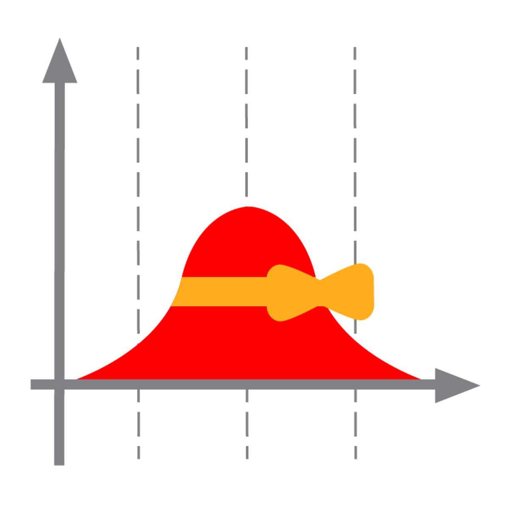

#  Курс 4 "Построение выводов по данным"
Влияет ли знание методов анализа данных на уровень заработной платы? Работает ли система оценки кредитоспособности клиентов банка? Действительно ли новый баннер лучше старого? Чтобы ответить на такие вопросы, нужно собрать данные. Данные почти всегда содержат шум, поэтому утверждения, которые можно сделать на их основе, верны не всегда, а только с определённой вероятностью. Строить наиболее корректные выводы и численно оценивать степень уверенности в них помогают методы статистики. 

Как можно оценивать неизвестные параметры системы по небольшому количеству наблюдений? Как измерить точность таких оценок? Какие данные нужны, чтобы ответить на ваш вопрос, и на какие вопросы можно ответить с помощью уже имеющихся данных? Вы узнаете все, что нужно для успешного превращения данных в выводы — организация экспериментов, A/B-тестирование, универсальные методы оценки параметров и проверки гипотез, корреляции и причинно-следственные связи.

## [Неделя 1](week_1.md) Кластеризация
 * Введение в кластеризацию
 * Подробнее о методах кластеризации
 * __Assignment__ Размещение баннеров

## [Неделя 2](week_2.md) Понижение размерности и матричные разложения
 *  Понижение размерности и отбор признаков
 *  __Assignment__ Метод главных компонент
 *  Матричные разложения

## [Неделя 3](week_3.md) Визуализация и поиск аномалий
 * Поиск аномалий
 * Визуализация данных
 * __Assignment__ Визуализация данных
 
## [Неделя 4](week_4.md) Тематическое моделирование
 * Тематическое моделирование-1
 * Тематическое моделирование-2
 * __Assignment__ Тематическое моделирование
 * __Assignment__ Тематическая модель [Постнауки](https://postnauka.ru/)
